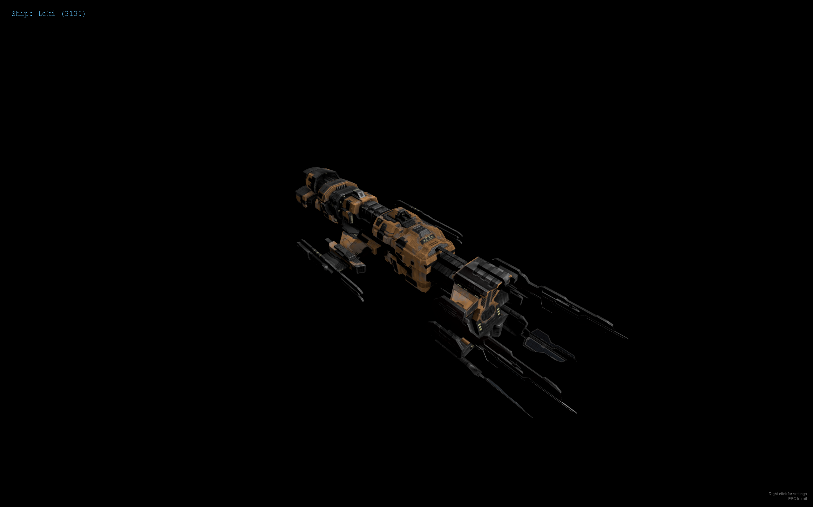

# EVE Ships Screensaver

Electron-based Windows screensaver-style app that displays EVE Online ships in 3D using Three.js, with configurable camera and lighting behavior.



## Install (No npm Required)

If you just want to use the screensaver, download and run the latest installer from Releases:

- Latest release: https://github.com/paulgiuliano/eve-ships-screensaver/releases/latest
- Download the Windows installer from the release assets
- Run the installer and select **EVE Ships Screensaver** in Windows Screen Saver settings

## Quick Start

```bash
npm install
npm start
```

Development mode (opens Chromium devtools):

```bash
npm run dev
```

Build Windows installer:

```bash
npm run build:win
```

Install as a Windows screensaver:

1. Build and run the installer from `dist/`.
2. The installer automatically registers `EVE Ships Screensaver.scr` in `C:\Windows\System32`.
3. Open Screen Saver settings (`control desk.cpl,,1`) and choose **EVE Ships Screensaver**.

## What It Does

- Loads ship models from the EVE Model Gallery (`_lite.glb` files).
- Displays ships fullscreen with smooth camera motion and lighting presets.
- Persists user settings with `electron-store`.
- Supports one-click refresh for ship catalog and name metadata.

## Controls

- `ESC`: Exit screensaver window
- Right-click: Open Settings
- Menu -> File -> Settings: Open Settings

## Windows Screensaver Launch Modes

The app supports standard screensaver command-line modes:

- `/s`: Start fullscreen screensaver mode
- `/c`: Open settings/config window
- `/p <HWND>`: Start preview-safe mode (compact window fallback)

## Settings Overview

- Backdrop color
- Rotation speed
- Lighting preset (`ambient`, `bright`, `dramatic`, `dark`)
- Lighting intensity multiplier
- Camera distance
- Dynamic camera distance auto-fit
- Camera pattern (`orbit`, `carousel`, `showcase`, `examine`)
- Auto-rotate toggle
- Display duration per ship

Full field reference and defaults: see [CONFIGURATION.md](CONFIGURATION.md).

## Ship Catalog and Metadata

On startup, the app attempts to fetch:

- Full ship model catalog from EVE Model Gallery repository tree
- Ship name metadata index for human-readable overlay names

Caching behavior:

- Catalog and metadata are cached locally for 24 hours
- If remote fetch fails, app falls back to cached data
- If no cache is available, app falls back to bundled legacy starter ships

Settings UI actions:

- `Refresh Ship Names Only`: refreshes metadata map only
- `Refresh Ships and Names`: refreshes model catalog + metadata and updates active ship list

## Model Source and Acknowledgement

This project does not include original ship assets created in this repository. Ship models and related index data are sourced from the EVE Model Gallery repository:

- Source repository: https://github.com/EstamelGG/EVE_Model_Gallery
- Model path pattern used by this app: `docs/models/*_lite.glb`
- Metadata index files used by this app:
  - `docs/statics/resources_index_en.json`
  - `docs/statics/resources_index_zh.json`

**Legal Notice:**
EVE Online and all related IP, including ship designs, names, and assets, are owned by CCP Games hf. This project is an unofficial fan creation not affiliated with or endorsed by CCP Games.

Acknowledgement:
Special thanks to the maintainers and contributors of EVE Model Gallery for collecting, structuring, and publishing the model and metadata resources that make this screensaver possible.

## Project Structure

```text
src/
  main.js                Electron main process and IPC handlers
  preload.cjs            Context-isolated API bridge
  ui/
    screensaver.html     Fullscreen renderer shell
    screensaver.js       Three.js scene, loading, animation
    settings.html        Settings UI
    settings.js          Settings UI logic
  ShipManager.js         Legacy helper module (not on active runtime path)
  CameraController.js    Legacy helper module (not on active runtime path)
```

## Documentation Layout

This project now uses two maintained docs:

- [README.md](README.md): setup, usage, architecture, operations
- [CONFIGURATION.md](CONFIGURATION.md): complete settings reference

## Troubleshooting

### Models do not load

- Verify internet access to GitHub for initial catalog fetch
- Run with `npm run dev` and check devtools console for loader/network errors

### Settings seem not to apply

- Change a setting in the Settings window and close/reopen screensaver
- Confirm no runtime errors in devtools console

### Performance is stuttery

- Lower rotation speed
- Increase camera distance
- Use `ambient` preset with reduced lighting intensity

## License

MIT
